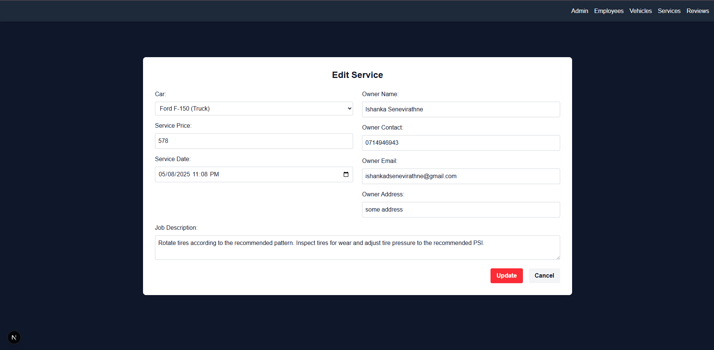

# Car Management Service : Auto Alchemist

**Project Title:** Car Management Service : Auto Alchemist 

### Home Page

**Component:** Home Page 
**Description of Component:** This is the main landing page of the Auto Alchemist application. It provides an overview of the services offered and likely serves as the entry point for users. 
**Available CRUD Operations:** Not applicable for a static home page. 
 
**User Interfaces:** 

 

### Admin

**Component:** Admin 
**Description of Component:** This section allows administrators to manage other admin accounts within the system. This includes the ability to add new administrators, remove existing ones, and view a list of all current administrators. 
**Available CRUD Operations:** Create (admins), Read (view admins), Delete (admins) 
 
**User Interfaces:** 

 
 

### Employee

**Component:** Employee 
**Description of Component:** This module is dedicated to managing employee records. This includes adding new employee profiles, remove employee accounts, and view a comprehensive list of all employees in the system. 
**Available CRUD Operations:** Create (employees), Read (view employees), Delete (employees) 
 
**User Interfaces:** 

 
 

### Car

**Component:** Car 
**Description of Component:** This section focuses on the management of vehicle information within the application. It enables the creation of new car entries and provides a view of the existing car database. 
**Available CRUD Operations:** Create (cars), Read (view cars) 
 
**User Interfaces:** 

 
 

### Service

**Component:** Service 
**Description of Component:** This module handles the management of the service jobs. This includes adding new services, view the list of current/completed services, remove services, and modify the details of existing services. 
**Available CRUD Operations:** Create (services), Read (view services), Delete (services), Update (edit services) 
 
**User Interfaces:** 

 
 
 

### Review

**Component:** Review 
**Description of Component:** This section allows for the management of customer reviews. Users can create new reviews related to a specific service task, and view these reviews within the system. 
**Available CRUD Operations:** Create (reviews), Read (view reviews) 
 
**User Interfaces:** 

 
 
